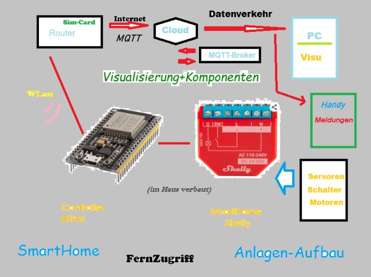
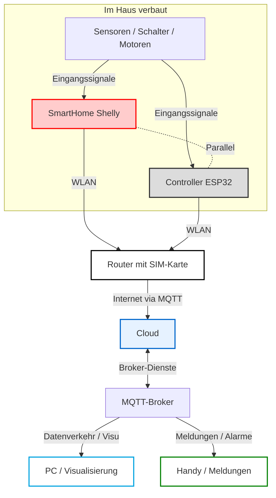

# SmartHomeRw Anlagen-Aufbau & Flussdiagramm  

Dieses Dokument beschreibt die Architektur und den Datenfluss einer selbst Entwickelten SmartHome.

---

## 1. Flussdiagramm (Mermaid)

---

## 2. Beschreibung der Systemarchitektur

Die Anwendung realisiert einen zuverlässigen **Fernzugriff** und eine **Visualisierung** von Steuerungs- und Haustechnikkomponenten über das Internet mittels des IoT-Protokolls **MQTT**.

### Feld- und Steuerungsebene (Im Haus verbaut)
* **Sensoren, Schalter & Motoren:** Physikalische Peripheriegeräte zur Erfassung von Zuständen und Ausführung von Aktionen (z. B. Lichtschalter, Relais, Antriebe).
* **SmartHome Shelly & ESP32 Controller (Parallelbetrieb):** Beide Komponenten arbeiten parallel auf der Steuerungsebene. Sie erfassen Eingangssignale der Peripherie unabhängig voneinander oder ergänzen sich in ihren Schalt- und Messfunktionen.

### Netzwerkinfrastruktur & Internetanbindung
* **WLAN:** Sowohl der Shelly als auch der ESP32-Controller übertragen ihre Daten parallel und drahtlos zum lokalen Gateway.
* **Router (mit SIM-Karte):** Ein Mobilfunk-Router, der die Anlage über das Mobilfunknetz ungebunden von Festnetzanschlüssen mit dem Internet verbindet.

### Cloud- und Vermittlungsschicht
* **Internet / MQTT:** Das schlanke Message Queuing Telemetry Transport Protokoll sorgt für einen ressourcenschonenden Datenaustausch.
* **Cloud & MQTT-Broker:** Die zentrale Instanz im Web, die Nachrichten von der Anlage empfängt (Publish) und an die registrierten Endgeräte verteilt (Subscribe).

### Monitoring & Benutzerschnittstelle (Fernzugriff)
* **PC (Visu):** Stationäre oder detaillierte grafische Benutzeroberfläche zur Anlagenüberwachung und Konfiguration.
* **Handy (Meldungen):** Mobiler Empfang von Statusmeldungen, Störungsmeldungen oder Alarmen in Echtzeit.
